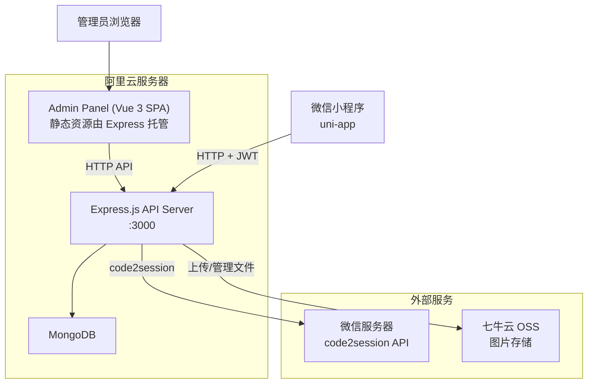
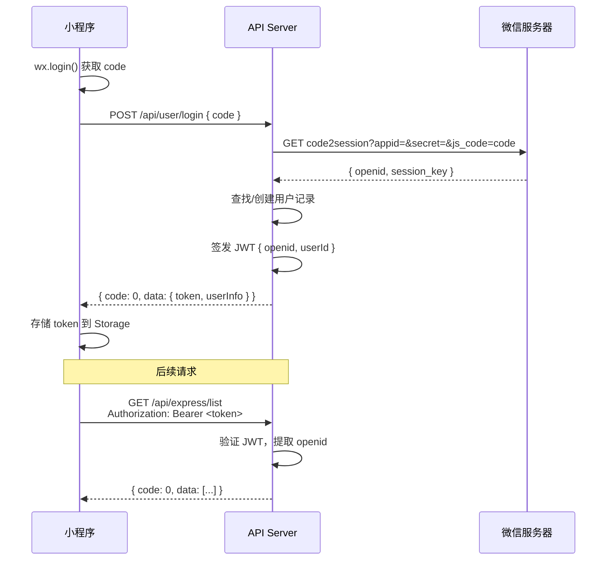

# Design Document: Backend Migration & Admin Panel

## Overview

本设计将校园跑腿小程序从微信云开发架构迁移到自建服务器架构。核心改造分为三层：

1. **API 层**：用 Express.js 构建 RESTful API，替代 12 个微信云函数
2. **数据层**：MongoDB 替代微信云数据库，七牛云 OSS 替代微信云存储
3. **管理层**：Vue 3 + Element Plus 构建后台管理 Web 应用

整体架构保持前后端分离，API 服务和管理面板共用同一个 Node.js 服务进程，管理面板作为静态资源由 API 服务托管。

## Architecture



### 目录结构

```
server/                          # 新增的后端项目目录
├── app.js                       # Express 入口，中间件配置
├── config/
│   └── index.js                 # 配置加载（环境变量）
├── middleware/
│   ├── auth.js                  # JWT 鉴权中间件（小程序用户）
│   └── adminAuth.js             # 管理员鉴权中间件
├── routes/
│   ├── user.js                  # /api/user/*
│   ├── express.js               # /api/express/*
│   ├── errand.js                # /api/errand/*
│   ├── carpool.js               # /api/carpool/*
│   ├── market.js                # /api/market/*
│   ├── forum.js                 # /api/forum/*
│   ├── team.js                  # /api/team/*
│   ├── message.js               # /api/message/*
│   ├── order.js                 # /api/order/*
│   ├── home.js                  # /api/home/*
│   ├── skill.js                 # /api/skill/*
│   ├── upload.js                # /api/upload/*
│   └── admin.js                 # /api/admin/*（管理后台专用）
├── models/                      # Mongoose models
│   ├── User.js
│   ├── ExpressOrder.js
│   ├── ErrandTask.js
│   ├── Carpool.js
│   ├── ForumPost.js
│   ├── ForumComment.js
│   ├── MarketGoods.js
│   ├── TeamActivity.js
│   ├── TeamMember.js
│   ├── Message.js
│   ├── UserFavorite.js
│   ├── SmsCode.js
│   ├── Stat.js
│   ├── Skill.js
│   ├── AdminUser.js
│   └── PageConfig.js
├── services/
│   ├── qiniu.js                 # 七牛云上传服务
│   └── wechat.js                # 微信 code2session 服务
├── package.json
└── .env.example                 # 环境变量模板

admin/                           # 管理后台前端项目
├── src/
│   ├── App.vue
│   ├── main.js
│   ├── router/index.js
│   ├── api/index.js             # axios 封装
│   ├── stores/auth.js           # Pinia 状态管理
│   ├── layouts/AdminLayout.vue  # 侧边栏布局
│   └── views/
│       ├── Login.vue
│       ├── Dashboard.vue
│       ├── Users.vue
│       ├── ExpressOrders.vue
│       ├── ErrandTasks.vue
│       ├── Carpool.vue
│       ├── MarketGoods.vue
│       ├── ForumPosts.vue
│       ├── TeamActivities.vue
│       ├── Skills.vue
│       ├── Messages.vue
│       ├── PageConfig.vue
│       └── Stats.vue
├── package.json
└── vite.config.js
```

## Components and Interfaces

### 1. API Server (Express.js)

**路由映射规则**：每个原云函数模块对应一个路由文件，每个 action 对应一个 HTTP 端点。

| 原云函数 | 原 action | 新 API 端点 | 方法 |
|---------|----------|------------|------|
| user | login | POST /api/user/login | POST |
| user | getProfile | GET /api/user/profile | GET |
| user | updateProfile | PUT /api/user/profile | PUT |
| user | registerRider | POST /api/user/register-rider | POST |
| user | getStats | GET /api/user/stats | GET |
| user | toggleFavorite | POST /api/user/favorite | POST |
| user | checkFavorite | GET /api/user/favorite/check | GET |
| user | myFavorites | GET /api/user/favorites | GET |
| user | sendSmsCode | POST /api/user/sms/send | POST |
| user | verifySmsCode | POST /api/user/sms/verify | POST |
| express | list | GET /api/express/list | GET |
| express | detail | GET /api/express/:id | GET |
| express | create | POST /api/express | POST |
| express | accept | POST /api/express/:id/accept | POST |
| express | updateStatus | PUT /api/express/:id/status | PUT |
| express | uploadPhoto | POST /api/express/:id/photo | POST |
| express | cancel | POST /api/express/:id/cancel | POST |
| express | updateLocation | PUT /api/express/:id/location | PUT |
| express | buildingStats | GET /api/express/building-stats | GET |
| errand | list | GET /api/errand/list | GET |
| errand | detail | GET /api/errand/:id | GET |
| errand | create | POST /api/errand | POST |
| errand | accept | POST /api/errand/:id/accept | POST |
| errand | updateStatus | PUT /api/errand/:id/status | PUT |
| errand | cancel | POST /api/errand/:id/cancel | POST |
| errand | uploadPhoto | POST /api/errand/:id/photo | POST |
| carpool | list | GET /api/carpool/list | GET |
| carpool | detail | GET /api/carpool/:id | GET |
| carpool | create | POST /api/carpool | POST |
| carpool | join | POST /api/carpool/:id/join | POST |
| carpool | leave | POST /api/carpool/:id/leave | POST |
| market | list | GET /api/market/list | GET |
| market | detail | GET /api/market/:id | GET |
| market | create | POST /api/market | POST |
| market | want | POST /api/market/:id/want | POST |
| market | myGoods | GET /api/market/my | GET |
| market | delete | DELETE /api/market/:id | DELETE |
| forum | list | GET /api/forum/list | GET |
| forum | detail | GET /api/forum/:id | GET |
| forum | create | POST /api/forum | POST |
| forum | like | POST /api/forum/:id/like | POST |
| forum | comment | POST /api/forum/:id/comment | POST |
| forum | myPosts | GET /api/forum/my | GET |
| forum | deletePost | DELETE /api/forum/:id | DELETE |
| forum | deleteComment | DELETE /api/forum/comment/:id | DELETE |
| team | list | GET /api/team/list | GET |
| team | detail | GET /api/team/:id | GET |
| team | create | POST /api/team | POST |
| team | join | POST /api/team/:id/join | POST |
| team | leave | POST /api/team/:id/leave | POST |
| team | uploadPhoto | POST /api/team/:id/photo | POST |
| team | end | POST /api/team/:id/end | POST |
| message | list | GET /api/message/list | GET |
| message | unreadCount | GET /api/message/unread-count | GET |
| message | markRead | PUT /api/message/:id/read | PUT |
| message | markAllRead | PUT /api/message/read-all | PUT |
| message | send | POST /api/message | POST |
| order | myPublished | GET /api/order/my-published | GET |
| order | myAccepted | GET /api/order/my-accepted | GET |
| order | myCarpool | GET /api/order/my-carpool | GET |
| home | getLiveData | GET /api/home/live-data | GET |
| home | getLatestOrders | GET /api/home/latest-orders | GET |
| skill | list | GET /api/skill/list | GET |
| skill | create | POST /api/skill | POST |
| skill | detail | GET /api/skill/:id | GET |
| upload | image | POST /api/upload/image | POST |
| upload | images | POST /api/upload/images | POST |

### 2. 鉴权流程



**JWT Token 结构**：
```javascript
{
  openid: "用户openid",
  userId: "MongoDB _id",
  iat: 签发时间,
  exp: 过期时间 (7天)
}
```

**管理员 JWT Token 结构**：
```javascript
{
  adminId: "MongoDB _id",
  username: "管理员用户名",
  role: "admin",
  iat: 签发时间,
  exp: 过期时间 (24小时)
}
```

### 3. 七牛云上传服务

```javascript
// services/qiniu.js 接口设计
module.exports = {
  // 生成上传凭证
  getUploadToken(bucket, keyPrefix),
  // 服务端上传文件
  uploadFile(localPath, key),
  // 获取文件公开访问 URL
  getPublicUrl(key),
  // 删除文件
  deleteFile(key)
}
```

上传流程：小程序选择图片 → `uni.uploadFile` 发送到 API Server → API Server 用 `qiniu` SDK 上传到七牛云 → 返回公开 URL。

### 4. 前端 callCloud 适配层

```javascript
// src/utils/cloud.js 改造后
const BASE_URL = 'https://your-server.com/api'

export const callCloud = async (name, action, data = {}) => {
  const token = uni.getStorageSync('token')
  const url = buildUrl(name, action, data)  // 映射到 RESTful 端点
  const method = getMethod(action)           // 根据 action 决定 GET/POST/PUT/DELETE
  
  const res = await uni.request({
    url, method,
    data: method === 'GET' ? undefined : data,
    header: { 'Authorization': `Bearer ${token}` }
  })
  return res.data
}
```

关键设计决策：保留 `callCloud(name, action, data)` 的调用签名，内部做路由映射，这样页面代码几乎不需要改动。

### 5. Admin Panel 组件设计

**布局**：左侧固定侧边栏 + 右侧内容区，侧边栏菜单与小程序功能模块一一对应。

**通用功能组件**：
- `DataTable`：分页表格，支持搜索、筛选、排序
- `InlineEdit`：点击文字即可编辑，回车保存
- `ImageUploader`：图片上传/替换，带预览
- `DragSort`：拖拽排序（基于 vuedraggable）
- `StatusTag`：订单状态标签

**管理员 API 端点**（全部需要 admin JWT）：

| 端点 | 方法 | 功能 |
|------|------|------|
| POST /api/admin/login | POST | 管理员登录 |
| GET /api/admin/users | GET | 用户列表（分页、搜索） |
| PUT /api/admin/users/:id | PUT | 编辑用户 |
| DELETE /api/admin/users/:id | DELETE | 删除用户 |
| GET /api/admin/express-orders | GET | 快递订单列表 |
| POST /api/admin/express-orders | POST | 创建虚拟订单 |
| PUT /api/admin/express-orders/:id | PUT | 编辑订单 |
| DELETE /api/admin/express-orders/:id | DELETE | 删除订单 |
| GET /api/admin/errand-tasks | GET | 跑腿任务列表 |
| PUT /api/admin/errand-tasks/:id | PUT | 编辑任务 |
| DELETE /api/admin/errand-tasks/:id | DELETE | 删除任务 |
| GET /api/admin/forum-posts | GET | 帖子列表 |
| DELETE /api/admin/forum-posts/:id | DELETE | 删除帖子（含评论） |
| PUT /api/admin/forum-posts/:id | PUT | 编辑帖子 |
| GET /api/admin/market-goods | GET | 商品列表 |
| DELETE /api/admin/market-goods/:id | DELETE | 删除商品 |
| PUT /api/admin/market-goods/:id | PUT | 编辑商品 |
| GET /api/admin/carpool | GET | 拼车列表 |
| DELETE /api/admin/carpool/:id | DELETE | 删除拼车 |
| PUT /api/admin/carpool/:id | PUT | 编辑拼车 |
| GET /api/admin/team-activities | GET | 组队列表 |
| DELETE /api/admin/team-activities/:id | DELETE | 删除组队（含成员） |
| PUT /api/admin/team-activities/:id | PUT | 编辑组队 |
| GET /api/admin/skills | GET | 技能列表 |
| DELETE /api/admin/skills/:id | DELETE | 删除技能 |
| PUT /api/admin/skills/:id | PUT | 编辑技能 |
| GET /api/admin/messages | GET | 消息列表 |
| POST /api/admin/messages | POST | 发送系统消息 |
| DELETE /api/admin/messages/:id | DELETE | 删除消息 |
| GET /api/admin/page-config | GET | 获取页面配置 |
| PUT /api/admin/page-config | PUT | 更新页面配置 |
| GET /api/admin/stats | GET | 获取统计数据 |
| PUT /api/admin/stats | PUT | 更新统计数据 |
| GET /api/admin/dashboard | GET | 仪表盘聚合数据 |

## Data Models

### MongoDB Schema 设计

所有模型使用 Mongoose，以下列出关键字段。`_id` 由 MongoDB 自动生成。


**User**
```javascript
{
  openid: String,          // 微信 openid（唯一索引）
  name: String,
  avatar: String,          // 七牛云 URL
  phone: String,
  isRider: Boolean,
  riderId: String,
  riderInfo: {
    realName: String,
    phone: String,
    studentId: String,
    building: String
  },
  riderRegTime: Date,
  level: String,
  createTime: Date
}
```

**ExpressOrder**
```javascript
{
  openid: String,          // 发布者
  pickupPoint: String,
  pickupCode: String,
  expressCompany: String,
  sizeType: Number,
  sizeText: String,
  sizeClass: String,
  building: String,
  room: String,
  phone: String,
  price: Number,
  tip: Number,
  totalPrice: Number,
  remark: String,
  status: Number,          // 0=待接单,1=已接单,2=配送中,3=已完成,4=已取消
  statusText: String,
  statusColor: String,
  riderId: String,
  pickupPhoto: String,     // 七牛云 URL
  deliverPhoto: String,    // 七牛云 URL
  deliverPhotoTime: Date,
  completeTime: Date,
  autoConfirmed: Boolean,
  destLat: Number,
  destLng: Number,
  riderLat: Number,
  riderLng: Number,
  riderLocationTime: Date,
  createTime: Date
}
```

**ErrandTask**
```javascript
{
  openid: String,
  title: String,
  desc: String,
  price: Number,
  tip: Number,
  deadline: String,
  contact: String,
  images: [String],
  status: Number,          // 0=待接单,1=进行中,2=已完成,3=已取消,4=待确认
  statusText: String,
  statusColor: String,
  riderId: String,
  pickupPhoto: String,
  deliverPhoto: String,
  submitTime: Date,
  completeTime: Date,
  autoConfirmed: Boolean,
  publisher: String,
  createTime: Date
}
```

**Carpool**
```javascript
{
  openid: String,
  from: String,
  to: String,
  departTime: String,
  pickupLocation: String,
  maxPeople: Number,
  currentPeople: Number,
  deadline: String,
  contact: String,
  remark: String,
  publisher: String,
  members: [String],       // openid 数组
  createTime: Date
}
```

**ForumPost**
```javascript
{
  openid: String,
  nickname: String,
  avatar: String,
  content: String,
  images: [String],
  likes: Number,
  comments: Number,
  likedBy: [String],
  createTime: Date
}
```

**ForumComment**
```javascript
{
  postId: String,          // 关联 ForumPost._id
  openid: String,
  nickname: String,
  avatar: String,
  content: String,
  createTime: Date
}
```

**MarketGoods**
```javascript
{
  openid: String,
  title: String,
  desc: String,
  price: Number,
  category: String,
  images: [String],
  deliveryType: Number,
  deliveryText: String,
  contact: String,
  contactPublic: Number,
  views: Number,
  wants: Number,
  wantUsers: [String],
  publisher: String,
  status: String,
  createTime: Date
}
```

**TeamActivity**
```javascript
{
  openid: String,
  title: String,
  type: String,
  place: String,
  time: String,
  max: Number,
  current: Number,
  desc: String,
  images: [String],
  photos: [String],
  status: String,          // 'active' | 'ended'
  tag: String,
  owner: String,
  createTime: Date
}
```

**TeamMember**
```javascript
{
  activityId: String,
  openid: String,
  name: String,
  joinTime: Date
}
```

**Message**
```javascript
{
  toOpenid: String,
  fromOpenid: String,
  fromName: String,
  type: String,            // 'like', 'comment', 'order', 'system'
  title: String,
  content: String,
  targetId: String,
  targetType: String,
  read: Boolean,
  createTime: Date
}
```

**UserFavorite**
```javascript
{
  openid: String,
  targetId: String,
  targetType: String,      // 'post', 'goods'
  createTime: Date
}
```

**SmsCode**
```javascript
{
  phone: String,
  code: String,
  expireAt: Number,
  createTime: Date
}
```

**Stat**
```javascript
{
  key: String,             // 'global'
  todayDelivered: Number,
  totalOrders: Number
}
```

**Skill**
```javascript
{
  openid: String,
  publisher: String,
  title: String,
  category: String,
  desc: String,
  price: Number,
  priceUnit: String,
  works: [String],
  contact: String,
  contactType: String,
  status: Number,
  views: Number,
  createTime: Date
}
```

**AdminUser**
```javascript
{
  username: String,        // 唯一索引
  passwordHash: String,    // bcrypt 哈希
  role: String,            // 'admin'
  createTime: Date
}
```

**PageConfig**
```javascript
{
  page: String,            // 'home'
  sections: [{
    key: String,           // 'hero', 'actions', 'banners', 'orders'
    order: Number,
    visible: Boolean,
    title: String,
    items: [{
      text: String,
      emoji: String,
      image: String,
      link: String,
      bg: String,
      order: Number
    }]
  }],
  updateTime: Date
}
```

### 索引设计

| Collection | 索引 |
|-----------|------|
| users | `{ openid: 1 }` unique |
| express_orders | `{ openid: 1 }`, `{ riderId: 1 }`, `{ status: 1 }`, `{ building: 1 }`, `{ createTime: -1 }` |
| errand_tasks | `{ openid: 1 }`, `{ riderId: 1 }`, `{ status: 1 }`, `{ createTime: -1 }` |
| carpool | `{ openid: 1 }`, `{ createTime: -1 }` |
| forum_posts | `{ openid: 1 }`, `{ createTime: -1 }` |
| forum_comments | `{ postId: 1 }`, `{ createTime: -1 }` |
| market_goods | `{ openid: 1 }`, `{ category: 1 }`, `{ createTime: -1 }` |
| team_activities | `{ type: 1 }`, `{ createTime: -1 }` |
| team_members | `{ activityId: 1 }`, `{ openid: 1 }` |
| messages | `{ toOpenid: 1, read: 1 }`, `{ createTime: -1 }` |
| user_favorites | `{ openid: 1, targetId: 1, targetType: 1 }` unique |
| sms_codes | `{ phone: 1 }`, `{ expireAt: 1 }` TTL |
| admin_users | `{ username: 1 }` unique |
| page_config | `{ page: 1 }` unique |
| skills | `{ openid: 1 }`, `{ category: 1 }`, `{ status: 1 }` |


## Correctness Properties

*A property is a characteristic or behavior that should hold true across all valid executions of a system—essentially, a formal statement about what the system should do. Properties serve as the bridge between human-readable specifications and machine-verifiable correctness guarantees.*

### Property 1: API Response Format Consistency

*For any* API endpoint and any valid or invalid request, the response body SHALL contain a `code` field (0 for success, -1 for error), and error responses SHALL additionally contain a `msg` field.

**Validates: Requirements 1.3**

### Property 2: JWT Round-Trip

*For any* valid openid string, encoding it into a JWT token and then decoding that token SHALL yield the same openid value.

**Validates: Requirements 2.2, 2.3**

### Property 3: Invalid Token Rejection

*For any* malformed, expired, or wrongly-signed JWT token, the auth middleware SHALL reject the request with a 401 status code.

**Validates: Requirements 2.4**

### Property 4: Auto-Create User on New Openid

*For any* openid that does not exist in the users collection, after a successful login call, the users collection SHALL contain exactly one record with that openid.

**Validates: Requirements 2.5**

### Property 5: Pagination Consistency

*For any* collection, page size N, and page numbers P1 < P2, the items returned for page P2 SHALL not overlap with items returned for page P1, and the union of all pages SHALL equal the full dataset.

**Validates: Requirements 3.2**

### Property 6: Atomic Operations Correctness

*For any* document with a numeric field of value V and an increment of D, after the increment operation, the field value SHALL equal V + D. Similarly, pushing an element to an array SHALL increase its length by 1, and pulling an element SHALL decrease its length by 1 (if present).

**Validates: Requirements 3.3**

### Property 7: Server Timestamp Generation

*For any* newly created document, the `createTime` field SHALL be a valid Date within 5 seconds of the server's current time at creation.

**Validates: Requirements 3.4**

### Property 8: File Upload Correctness

*For any* file upload with a specified folder type F, the returned URL SHALL contain the folder prefix F in its path. *For any* batch upload of N files, the response SHALL contain exactly N URLs. Each URL SHALL be a valid HTTP(S) URL.

**Validates: Requirements 4.2, 4.3, 4.4**

### Property 9: URL Mapping Consistency

*For any* (functionName, action) pair from the original cloud function API, the `buildUrl(name, action)` mapping function SHALL produce a valid RESTful URL path matching the documented endpoint table.

**Validates: Requirements 5.1**

### Property 10: Admin Password Hashing Round-Trip

*For any* plaintext password, storing it as a bcrypt hash and then comparing the original password against the hash SHALL return true. Comparing any different password against the hash SHALL return false.

**Validates: Requirements 6.2**

### Property 11: Admin JWT Role Claim

*For any* successful admin login, the issued JWT token SHALL contain a `role` field with value `"admin"` and a valid `adminId` field.

**Validates: Requirements 6.3**

### Property 12: Non-Admin Access Rejection

*For any* regular user JWT token (without admin role), accessing any admin API endpoint SHALL return a 403 status code.

**Validates: Requirements 6.4**

### Property 13: Admin CRUD Round-Trip

*For any* resource type (user, order, post, goods, carpool, team, skill, message, page config) and any valid field update, reading the resource after an admin edit SHALL return the updated field values.

**Validates: Requirements 7.2, 8.3, 8.4, 9.3, 10.2**

### Property 14: User Deletion Cascade

*For any* user with associated favorites and messages, after admin deletion of that user, the users, user_favorites, and messages collections SHALL contain zero records for that user's openid.

**Validates: Requirements 7.3**

### Property 15: Admin Search Filter Correctness

*For any* search query on the users collection, all returned results SHALL match the filter criteria (name contains keyword, or phone matches, or openid matches, or rider status matches).

**Validates: Requirements 7.4**

### Property 16: Content Deletion Cascade

*For any* forum post with comments, or team activity with members, after admin deletion, both the parent record and all associated child records SHALL be removed from their respective collections.

**Validates: Requirements 9.2**

### Property 17: Page Config Persistence

*For any* page configuration update (text changes, section reordering), reading the page config after saving SHALL return the exact configuration that was saved, including section order.

**Validates: Requirements 10.3, 10.5**

### Property 18: System Message Delivery

*For any* system message sent by an admin to a target user, the messages collection SHALL contain a record with `toOpenid` matching the target user and `type` equal to `"system"`.

**Validates: Requirements 11.2**

### Property 19: Stats Aggregation Accuracy

*For any* set of data across express_orders, errand_tasks, and users collections, the dashboard aggregation endpoint SHALL return counts that match the actual document counts in those collections.

**Validates: Requirements 12.2**

## Error Handling

### API Server 错误处理策略

1. **全局错误中间件**：Express 全局 error handler 捕获未处理异常，返回 `{ code: -1, msg: '服务器内部错误' }`，同时记录错误日志
2. **参数校验**：每个路由使用 `express-validator` 或手动校验，缺少必填字段返回 `{ code: -1, msg: 'missing fields' }`
3. **鉴权错误**：
   - 无 token → 401 `{ code: -1, msg: '未登录' }`
   - token 过期 → 401 `{ code: -1, msg: 'token已过期' }`
   - 非管理员访问管理接口 → 403 `{ code: -1, msg: '无权限' }`
4. **数据库错误**：MongoDB 连接失败或查询异常 → 500 `{ code: -1, msg: '数据库错误' }`
5. **七牛云错误**：上传失败 → 500 `{ code: -1, msg: '文件上传失败' }`
6. **微信 API 错误**：code2session 失败 → `{ code: -1, msg: '微信登录失败' }`
7. **资源不存在**：查询单条记录不存在 → `{ code: -1, msg: '记录不存在' }`

### 前端错误处理

1. **网络异常**：`callCloud` 封装中 catch 网络错误，显示 toast 提示
2. **401 响应**：自动清除本地 token，重新触发 `wx.login()` 流程
3. **业务错误**：显示服务端返回的 `msg` 字段内容

## Testing Strategy

### 测试框架选择

- **单元测试 + 属性测试**：Vitest（项目已有配置）
- **属性测试库**：fast-check（JavaScript 生态最成熟的 PBT 库）
- **HTTP 测试**：supertest（测试 Express 路由）
- **数据库测试**：mongodb-memory-server（内存 MongoDB，无需外部依赖）

### 测试分层

1. **单元测试**：
   - JWT 工具函数（签发、验证、解码）
   - URL 映射函数（callCloud 路由映射）
   - 七牛云上传工具函数
   - 数据校验函数
   - 24小时自动确认逻辑

2. **属性测试**（每个 property 至少 100 次迭代）：
   - Property 2: JWT round-trip
   - Property 3: Invalid token rejection
   - Property 5: Pagination consistency
   - Property 6: Atomic operations
   - Property 9: URL mapping
   - Property 10: Admin password hashing round-trip
   - Property 13: Admin CRUD round-trip
   - Property 17: Page config persistence

3. **集成测试**（supertest + mongodb-memory-server）：
   - 完整登录流程
   - 订单 CRUD 流程
   - 管理员权限验证
   - 文件上传流程

### 属性测试标注格式

每个属性测试必须包含注释标注：

```javascript
// Feature: backend-migration-admin, Property 2: JWT Round-Trip
// Validates: Requirements 2.2, 2.3
test.prop('JWT round-trip preserves openid', [fc.string()], (openid) => {
  const token = signToken({ openid })
  const decoded = verifyToken(token)
  expect(decoded.openid).toBe(openid)
})
```

### 测试配置

```javascript
// fast-check 配置
{ numRuns: 100 }  // 每个属性测试最少 100 次迭代
```
