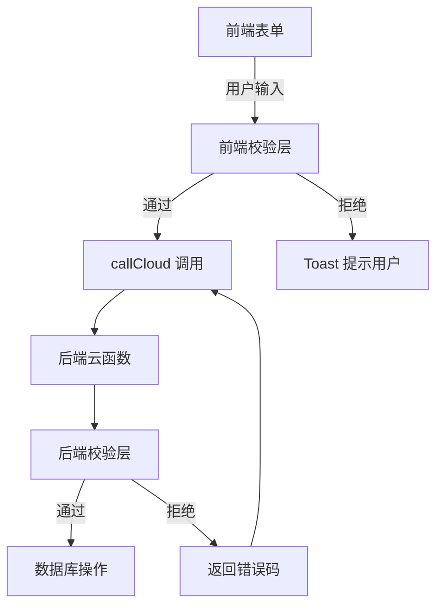
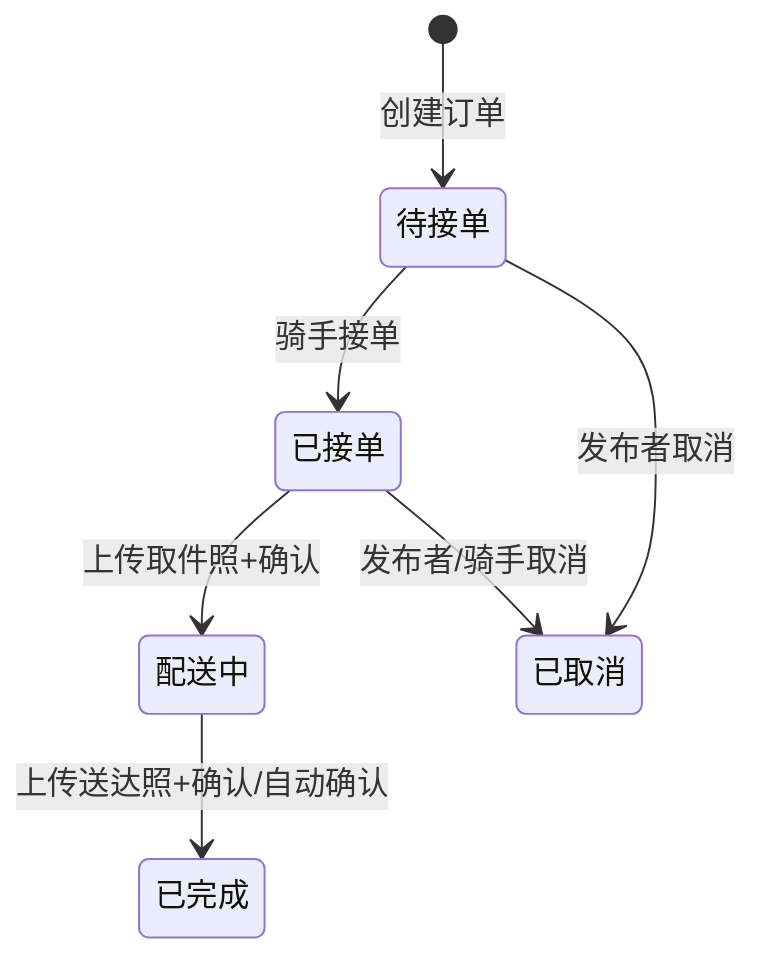
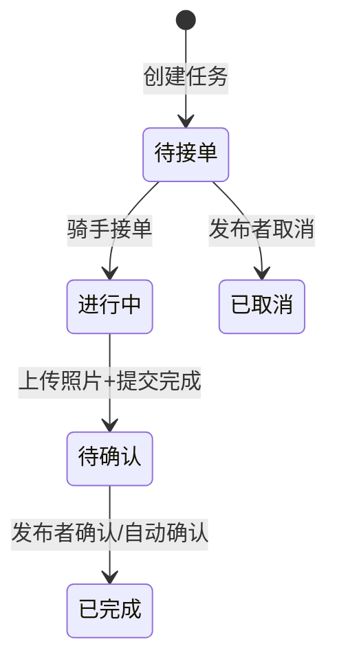

# Design Document: Bug Detection Plan

## Overview

本设计文档描述了对校园跑腿小程序进行系统性 Bug 检测和修复的技术方案。通过代码审查发现了 16 类问题，涵盖前端校验缺失、后端验证不足、状态流转无守卫、前后端数据不一致等方面。修复方案采用"后端优先"策略——所有关键校验必须在后端云函数中实现，前端校验作为用户体验优化的补充。

## Architecture

### 修复策略：后端优先，前端补充



### 校验分层原则

| 层级 | 职责 | 示例 |
|------|------|------|
| 前端校验 | UX 优化，即时反馈 | 手机号格式、必填项、金额范围 |
| 后端校验 | 安全保障，数据完整性 | 身份验证、状态流转、金额范围、照片存在性 |

前端校验可以被绕过（直接调用云函数），因此所有安全相关的校验必须在后端实现。

## Components and Interfaces

### 1. 校验工具函数（新增）

在各云函数中添加内联校验逻辑，不创建独立的校验模块（因为每个云函数是独立部署的）。

### 2. 需要修改的云函数

| 云函数 | 修改内容 |
|--------|----------|
| `cloudfunctions/express/index.js` | create: 校验 phone/room/price/tip; updateStatus: 状态流转守卫+照片校验 |
| `cloudfunctions/errand/index.js` | create: 校验 price; updateStatus: 状态流转守卫+照片校验; accept: 骑手身份校验 |
| `cloudfunctions/market/index.js` | create: 校验 price>0, contact 非空 |
| `cloudfunctions/carpool/index.js` | create: 校验时间合理性 |
| `cloudfunctions/team/index.js` | create: 校验 max 人数范围 |
| `cloudfunctions/skill/index.js` | create: 校验 price>0, title/contact 非空 |
| `cloudfunctions/forum/index.js` | create: 校验 content 长度; comment: 校验 content 长度 |
| `cloudfunctions/user/index.js` | sendSmsCode: 频率限制; verifySmsCode: 尝试次数限制; registerRider: 保存 school/studentCardFileID |

### 3. 需要修改的前端页面

| 页面 | 修改内容 |
|------|----------|
| `src/pages/express/create.vue` | 添加 phone 格式校验、tip 范围校验 |
| `src/pages/express/detail.vue` | 已有照片守卫（前端），确认后端也有 |
| `src/pages/errand/create.vue` | 添加 price 上限校验、phone 格式校验 |
| `src/pages/market/create.vue` | 添加 price>0 校验、contact 必填校验 |
| `src/pages/carpool/create.vue` | 添加时间合理性校验 |
| `src/pages/team/create.vue` | 添加 max 人数范围校验 |
| `src/pages/skill/create.vue` | 添加 price>0 校验、desc 必填校验 |

## Data Models

### 状态流转定义

#### 快递订单状态机



合法状态转换表（express）:
- `0 → 1` (待接单 → 已接单): 需要骑手身份
- `1 → 2` (已接单 → 配送中): 需要 pickupPhoto 存在
- `2 → 3` (配送中 → 已完成): 需要 deliverPhoto 存在
- `0 → 4` (待接单 → 已取消): 发布者操作
- `1 → 4` (已接单 → 已取消): 发布者或骑手操作

#### 跑腿任务状态机



合法状态转换表（errand）:
- `0 → 1` (待接单 → 进行中): 需要骑手身份
- `1 → 4` (进行中 → 待确认): 需要 pickupPhoto + deliverPhoto 存在
- `4 → 2` (待确认 → 已完成): 发布者操作
- `0 → 3` (待接单 → 已取消): 发布者操作

### 短信验证码频率限制数据结构

在 `sms_codes` 集合中增加字段：

```javascript
{
  phone: '13800138000',
  code: '123456',
  expireAt: 1700000000000,
  createTime: serverDate(),
  // 新增字段
  attempts: 0,          // 验证尝试次数
  lockedUntil: null     // 锁定截止时间
}
```

### 骑手注册数据补全

`users` 集合中 `riderInfo` 字段补充：

```javascript
riderInfo: {
  realName: '张三',
  phone: '13800138000',
  studentId: '202012345678',
  building: '东区六舍男',
  school: '北京邮电大学',           // 新增
  studentCardFileID: 'cloud://...'  // 新增
}
```

### 快递订单数据补全

`express_orders` 集合补充 phone 字段：

```javascript
{
  // ... 现有字段
  phone: '13800138000'  // 新增：下单人联系电话
}
```

### 跑腿任务数据补全

`errand_tasks` 集合补充字段：

```javascript
{
  // ... 现有字段
  remark: '放门口就行',     // 已传但未存
  timeRequire: '1小时内'    // 已传但未存
}
```


## Correctness Properties

*A property is a characteristic or behavior that should hold true across all valid executions of a system—essentially, a formal statement about what the system should do. Properties serve as the bridge between human-readable specifications and machine-verifiable correctness guarantees.*

### Property 1: Express photo guard

*For any* express order, calling updateStatus to transition to status 2 (配送中) should succeed only if pickupPhoto exists, and transitioning to status 3 (已完成) should succeed only if deliverPhoto exists. Orders without the required photos must be rejected.

**Validates: Requirements 1.1, 1.2, 1.3, 1.4**

### Property 2: Errand photo guard

*For any* errand task, calling updateStatus to transition to status 4 (待确认) should succeed only if both pickupPhoto and deliverPhoto exist. Tasks without the required photos must be rejected.

**Validates: Requirements 2.1, 2.2**

### Property 3: Phone number validation

*For any* string input, the phone validation function should accept it if and only if it matches the pattern `/^1[3-9]\d{9}$/`. All other strings (including empty, whitespace-only, non-numeric, wrong length, or starting with invalid digits) must be rejected.

**Validates: Requirements 3.1, 3.2, 3.3, 3.4**

### Property 4: Price range validation

*For any* numeric input submitted as a price or tip:
- Express order price must be one of the predefined sizes (2, 5, 20)
- Express tip must be >= 0 and <= 99
- Errand price must be > 0 and <= 999
- Market goods price must be > 0 and <= 99999
- Skill price must be > 0

Values outside these ranges must be rejected by the backend.

**Validates: Requirements 5.1, 5.2, 5.3, 5.4, 5.5, 5.6**

### Property 5: Express order state machine

*For any* express order with current status S and requested target status T, the updateStatus call should succeed only if (S, T) is in the set of valid transitions: {(0,1), (1,2), (2,3)}. All other transitions (including same-state, backward, and transitions from terminal states 3 and 4) must be rejected.

**Validates: Requirements 6.1, 6.3, 6.4**

### Property 6: Errand task state machine

*For any* errand task with current status S and requested target status T, the updateStatus call should succeed only if (S, T) is in the set of valid transitions: {(0,1), (1,4), (4,2)}. All other transitions must be rejected.

**Validates: Requirements 6.2**

### Property 7: Carpool departure time must be in the future

*For any* carpool creation request, the departTime must represent a time strictly later than the current server time. Requests with past departure times must be rejected.

**Validates: Requirements 7.1, 7.3**

### Property 8: Carpool deadline before departure

*For any* carpool creation request where both deadline and departTime are provided, the deadline must be strictly earlier than the departTime. Requests where deadline >= departTime must be rejected.

**Validates: Requirements 7.2**

### Property 9: Team max people range

*For any* team activity creation request, the max field must be an integer in the range [2, 100]. Values outside this range (including 0, 1, negative numbers, non-integers, and values > 100) must be rejected.

**Validates: Requirements 8.1, 8.2**

### Property 10: Market contact required

*For any* market goods creation request, the contact field must be a non-empty, non-whitespace string. Requests with empty or whitespace-only contact must be rejected.

**Validates: Requirements 9.1, 9.2**

### Property 11: Skill required fields validation

*For any* skill creation request, the title, price, and contact fields must all be non-empty, and price must be > 0. Requests missing any of these fields must be rejected.

**Validates: Requirements 10.1, 10.2, 10.3**

### Property 12: Express room number validation

*For any* express order creation request, the room field must be a non-empty string with length between 1 and 10 characters. Requests with empty or overly long room numbers must be rejected.

**Validates: Requirements 11.1, 11.2**

### Property 13: Express order data persistence round-trip

*For any* express order created with a phone field, reading the order back from the database should return the same phone value that was submitted.

**Validates: Requirements 12.1**

### Property 14: Errand task data persistence round-trip

*For any* errand task created with remark and timeRequire fields, reading the task back from the database should return the same remark and timeRequire values that were submitted.

**Validates: Requirements 12.2**

### Property 15: Rider registration data persistence round-trip

*For any* rider registration with school and studentCardFileID fields, reading the user profile back should return the same school and studentCardFileID values.

**Validates: Requirements 12.3**

### Property 16: Forum content length validation

*For any* forum post creation request, the content must have length between 1 and 1000 characters. *For any* comment creation request, the content must have length between 1 and 500 characters. Requests outside these ranges must be rejected.

**Validates: Requirements 13.1, 13.2, 13.3**

### Property 17: Withdrawal balance validation

*For any* withdrawal request with amount A, given total income I, total completed withdrawals W, and total pending withdrawals P, the withdrawal should succeed only if A >= 1 and A <= (I - W - P). The pending withdrawal amount must be correctly deducted from available balance.

**Validates: Requirements 14.1, 14.2**

### Property 18: Rider permission for accepting orders

*For any* user attempting to accept an express or errand order, the operation should succeed only if the user's isRider field is true. Non-rider users must be rejected.

**Validates: Requirements 15.1, 15.2**

## Error Handling

### 后端错误响应规范

所有校验失败应返回统一格式：

```javascript
{ code: -1, msg: '具体错误描述' }
```

错误码分类：
| 场景 | msg 示例 |
|------|----------|
| 必填字段缺失 | `'请填写取件点'` |
| 格式校验失败 | `'手机号格式不正确'` |
| 范围校验失败 | `'报酬金额需在1-999元之间'` |
| 状态流转非法 | `'当前状态不允许此操作'` |
| 照片缺失 | `'请先上传取件照片'` |
| 权限不足 | `'需要注册骑手才能接单'` |
| 频率限制 | `'请求过于频繁，请稍后再试'` |

### 前端错误处理

- 校验失败使用 `uni.showToast({ title: msg, icon: 'none' })` 提示
- 后端返回 `code: -1` 时显示 `res.msg` 内容
- 网络错误使用通用提示 `'网络异常，请重试'`

## Testing Strategy

### 测试框架

- 单元测试和属性测试均使用 **Vitest** (项目已配置)
- 属性测试库使用 **fast-check** (`fc`)
- 测试文件放在 `tests/` 目录下

### 双重测试策略

**单元测试**：
- 验证具体的边界值和错误条件
- 测试特定的输入输出示例
- 覆盖 edge case（空字符串、null、undefined、极端值）

**属性测试**：
- 验证校验函数对所有输入的正确性
- 验证状态机转换的完整性
- 验证数据持久化的 round-trip 一致性
- 每个属性测试运行最少 100 次迭代

### 属性测试标注格式

每个属性测试必须包含注释引用设计文档中的属性编号：

```javascript
// Feature: bug-detection-plan, Property 1: Express photo guard
// Validates: Requirements 1.1, 1.2, 1.3, 1.4
```

### 测试范围

| 模块 | 单元测试 | 属性测试 |
|------|----------|----------|
| 手机号校验 | 边界值示例 | Property 3 |
| 价格校验 | 0、负数、极大值 | Property 4 |
| 状态流转 | 具体转换示例 | Property 5, 6 |
| 照片守卫 | 有/无照片示例 | Property 1, 2 |
| 时间校验 | 过去/未来时间 | Property 7, 8 |
| 人数校验 | 边界值 | Property 9 |
| 必填字段 | 空值示例 | Property 10, 11, 12 |
| 数据持久化 | 创建+读取 | Property 13, 14, 15 |
| 内容长度 | 边界长度 | Property 16 |
| 提现校验 | 余额不足示例 | Property 17 |
| 骑手权限 | 非骑手接单 | Property 18 |
