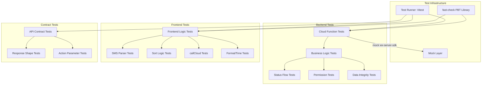

# Design Document: Comprehensive Testing

## Overview

本设计文档描述校园跑腿微信小程序的全面测试方案。由于项目后端是微信云函数（依赖 `wx-server-sdk` 和微信云数据库），前端是 uni-app（依赖微信小程序 API），无法在标准 Node.js 环境中直接运行。因此，测试策略采用**提取纯逻辑进行单元测试 + mock 云函数环境进行集成测试**的方式。

测试重点：
1. 云函数业务逻辑的正确性（状态流转、权限校验、数据一致性）
2. 前端纯逻辑函数的正确性（SMS 解析、排序、时间格式化）
3. 前后端接口契约的一致性
4. 业务操作合理性验证

## Architecture



## Components and Interfaces

### 1. Mock Layer (`tests/mocks/wx-server-sdk.js`)

模拟微信云函数 SDK，提供内存数据库实现：

```javascript
// 接口定义
class MockDatabase {
  collection(name)        // 返回 MockCollection
}

class MockCollection {
  where(query)            // 链式查询
  doc(id)                 // 按 ID 查询
  add({ data })           // 插入文档
  get()                   // 获取结果
  count()                 // 计数
  update({ data })        // 更新
  remove()                // 删除
  orderBy(field, order)   // 排序
  skip(n)                 // 跳过
  limit(n)                // 限制
}

// 工具函数
function createMockCloud(openid)  // 创建带指定 openid 的 mock 环境
function resetDatabase()          // 重置内存数据库
```

### 2. Cloud Function Test Harness

每个云函数测试通过直接调用 `exports.main(event, context)` 并传入 mock 环境：

```javascript
// 调用模式
const result = await cloudFunction.main(
  { action: 'create', data: { title: '...', desc: '...' } },
  {}
)
// 验证 result.code, result.data 等
```

### 3. Frontend Logic Extractors

将前端 Vue 组件中的纯逻辑函数提取为可独立测试的模块：

- `tests/logic/sms-parser.js` — 从 `express/create.vue` 提取 SMS 解析逻辑
- `tests/logic/order-sort.js` — 从 `index/index.vue` 提取排序逻辑
- `tests/logic/format-time.js` — 从多个组件提取时间格式化逻辑

## Data Models

### 测试数据结构

```javascript
// Express Order
{
  _id: String,
  openid: String,
  pickupPoint: String,
  pickupCode: String,
  expressCompany: String,
  sizeType: Number,        // 0=小件, 1=大件, 2=超大件
  sizeText: String,
  sizeClass: String,
  building: String,
  room: String,
  price: Number,
  tip: Number,
  remark: String,
  status: Number,          // 0=待接单, 1=已接单, 2=配送中, 3=已完成, 4=已取消
  riderId: String | null,
  createTime: Date
}

// Errand Task
{
  _id: String,
  openid: String,
  title: String,
  desc: String,
  fromAddr: String,
  toAddr: String,
  price: Number,
  tip: Number,
  phone: String,
  publisher: String,
  status: Number,          // 0=待接单, 1=进行中, 2=已完成, 3=已取消, 4=待确认
  riderId: String | null,
  createTime: Date
}

// Carpool
{
  _id: String,
  openid: String,
  from: String,
  to: String,
  departTime: String,
  maxPeople: Number,
  currentPeople: Number,
  members: String[],
  createTime: Date
}

// Team Activity
{
  _id: String,
  openid: String,
  title: String,
  type: String,
  max: Number,
  current: Number,
  status: String,          // 'active' | 'ended'
  tag: String,
  createTime: Date
}

// Forum Post
{
  _id: String,
  openid: String,
  nickname: String,
  content: String,
  images: String[],
  likes: Number,
  comments: Number,
  likedBy: String[],
  createTime: Date
}

// User
{
  _id: String,
  openid: String,
  name: String,
  avatar: String,
  phone: String,
  isRider: Boolean,
  riderId: String,
  createTime: Date
}

// Message
{
  _id: String,
  toOpenid: String,
  fromOpenid: String,
  fromName: String,
  type: String,
  title: String,
  content: String,
  targetId: String,
  targetType: String,
  read: Boolean,
  createTime: Date
}

// Market Goods
{
  _id: String,
  openid: String,
  title: String,
  desc: String,
  price: Number,
  category: String,
  status: String,          // 'active'
  views: Number,
  wants: Number,
  createTime: Date
}
```


## Correctness Properties

*A property is a characteristic or behavior that should hold true across all valid executions of a system — essentially, a formal statement about what the system should do. Properties serve as the bridge between human-readable specifications and machine-verifiable correctness guarantees.*

Based on the prework analysis, the following correctness properties have been identified:

### Property 1: Unknown action returns error with code -1

*For any* cloud function and *for any* random string that is not a recognized action name, calling the cloud function with that action SHALL return a response with `code: -1` and a `msg` field containing the unknown action string.

**Validates: Requirements 1.2, 1.4**

### Property 2: Express order accept rejects non-pending orders

*For any* express order with status !== 0, attempting to accept that order SHALL return `{ code: -1 }` with an error message, and the order's status and riderId SHALL remain unchanged.

**Validates: Requirements 2.3**

### Property 3: Express order cancel permission check

*For any* express order and *for any* user who is neither the order's openid (owner) nor the order's riderId, attempting to cancel that order SHALL return `{ code: -1, msg: '无权取消该订单' }`.

**Validates: Requirements 2.7**

### Property 4: Errand task accept rejects non-pending tasks

*For any* errand task with status !== 0, attempting to accept that task SHALL return `{ code: -1 }` with an error message, and the task's status and riderId SHALL remain unchanged.

**Validates: Requirements 3.3**

### Property 5: Carpool join/leave round-trip preserves member count

*For any* carpool that is not full, if a new user joins and then immediately leaves, the carpool's currentPeople and members array SHALL return to their original values.

**Validates: Requirements 4.1, 4.5**

### Property 6: Carpool full capacity rejection

*For any* carpool where currentPeople >= maxPeople, attempting to join SHALL return `{ code: -1, msg: '已满员' }` and the carpool's currentPeople SHALL remain unchanged.

**Validates: Requirements 4.2**

### Property 7: Carpool duplicate join rejection

*For any* carpool and *for any* user who is already in the members array, attempting to join again SHALL return `{ code: -1, msg: '已加入' }` and the carpool's currentPeople SHALL remain unchanged.

**Validates: Requirements 4.3**

### Property 8: Team activity join/capacity invariant

*For any* team activity, after a successful join, the activity's `current` field SHALL equal the number of records in `team_members` for that activity. When `current >= max`, the tag SHALL be '已满员'.

**Validates: Requirements 5.1, 5.4**

### Property 9: Forum like toggle round-trip

*For any* forum post and *for any* user, liking the post twice (like then unlike) SHALL restore the post's `likes` count and `likedBy` array to their original values.

**Validates: Requirements 6.1, 6.2**

### Property 10: Forum comment increments count

*For any* forum post, after a successful comment, the post's `comments` count SHALL equal the actual number of comment records for that post.

**Validates: Requirements 6.4**

### Property 11: Forum post deletion cascades to comments

*For any* forum post with associated comments, after the author deletes the post, no comment records with that postId SHALL exist in the database.

**Validates: Requirements 6.6**

### Property 12: Forum/Market non-owner deletion rejection

*For any* forum post or market goods item and *for any* user who is not the author/owner, attempting to delete SHALL return `{ code: -1 }` with an appropriate error message.

**Validates: Requirements 6.7, 12.5**

### Property 13: Mark all read leaves no unread messages

*For any* user with unread messages, after calling markAllRead, the unreadCount for that user SHALL be 0.

**Validates: Requirements 7.2**

### Property 14: Delete all messages leaves no messages

*For any* user with messages, after calling deleteAll, the message list for that user SHALL be empty.

**Validates: Requirements 7.4**

### Property 15: Invalid phone number rejection

*For any* string that does not match the pattern `/^1[3-9]\d{9}$/`, calling sendSmsCode with that string SHALL return `{ code: -1, msg: '手机号格式不正确' }`.

**Validates: Requirements 8.5**

### Property 16: Incorrect SMS code rejection

*For any* stored SMS code and *for any* verification attempt with a code that does not match the stored code, verifySmsCode SHALL return `{ code: -1, msg: '验证码错误' }`.

**Validates: Requirements 8.8**

### Property 17: Login idempotence

*For any* user, calling login multiple times SHALL always return the same user data (same openid, same name, same _id). The second call SHALL NOT create a duplicate user record.

**Validates: Requirements 8.2**

### Property 18: callCloud success pass-through

*For any* cloud function response with `code: 0`, callCloud SHALL return the exact same result object without modification.

**Validates: Requirements 9.1**

### Property 19: callCloud error handling

*For any* cloud function response with `code: -1` and a `msg` field, callCloud SHALL return the result object containing both `code` and `msg` fields.

**Validates: Requirements 9.2**

### Property 20: SMS parser extracted code is substring of input

*For any* SMS text that contains a recognizable pickup code, the extracted pickup code SHALL be a substring of the original SMS text.

**Validates: Requirements 10.1, 10.5**

### Property 21: SMS parser company extraction

*For any* SMS text that contains one of the known express company names (顺丰, 京东, 中通, 韵达, 圆通, 申通, 极兔, etc.), the extracted company SHALL match the company name present in the text.

**Validates: Requirements 10.3**

### Property 22: Order sorting priority hierarchy

*For any* list of orders with mixed statuses, after sorting, every pending order (status=0) SHALL appear before every non-pending order. Within the same status priority group, orders with higher tips SHALL appear first.

**Validates: Requirements 11.1, 11.2, 11.3**

### Property 23: Building filter count accuracy

*For any* list of orders, the building filter tabs SHALL have counts that sum to the total number of orders, and each building tab's count SHALL equal the number of orders with that building name.

**Validates: Requirements 11.4**

### Property 24: Market views increment

*For any* market goods item, calling detail N times SHALL result in the views count being incremented by exactly N from its original value.

**Validates: Requirements 12.2**

### Property 25: Search results contain keyword

*For any* keyword search on forum posts, every returned post's content SHALL contain the keyword (case-insensitive). *For any* keyword search on market goods, every returned item's title SHALL contain the keyword (case-insensitive).

**Validates: Requirements 13.1, 13.2**

### Property 26: Category filter correctness

*For any* category filter on market goods, every returned item SHALL have a category field matching the filter value.

**Validates: Requirements 13.3**

### Property 27: Favorite toggle round-trip

*For any* user and *for any* item, toggling favorite twice SHALL result in `favorited: false`, and checkFavorite SHALL confirm the item is not favorited.

**Validates: Requirements 14.1, 14.2, 14.3**

## Error Handling

### Cloud Function Error Handling

| Scenario | Expected Behavior |
|---|---|
| Unknown action | Return `{ code: -1, msg: 'unknown action: <action>' }` |
| Missing required fields | Return `{ code: -1, msg: 'missing fields' }` or specific message |
| Permission denied | Return `{ code: -1, msg: '<specific reason>' }` |
| Invalid state transition | Return `{ code: -1, msg: '<specific reason>' }` |
| Database operation failure | Error propagates (no explicit catch in most functions) |

### Frontend Error Handling

| Scenario | Expected Behavior |
|---|---|
| Cloud function returns code: -1 | callCloud shows toast with error message |
| Network error | callCloud shows toast '网络异常，请重试' |
| User not logged in | checkLogin redirects to login page |

### Known Issues to Test

1. **skill 云函数参数不一致**: skill 从 `event` 直接读参数，其他云函数从 `event.data` 读。前端 callCloud 统一发送 `{ action, data }` 格式，导致 skill 的 `list`/`create`/`detail` 等 action 可能收不到正确参数。
2. **skill 使用 `_openid` 而非 `openid`**: skill 用 `_openid` 字段标识用户，其他云函数用 `openid`，可能导致数据查询不一致。
3. **forum/market 搜索在客户端过滤**: keyword 过滤在数据库查询之后进行，分页时可能返回少于 pageSize 的结果。
4. **message markAllRead/deleteAll 限制 100 条**: 如果用户有超过 100 条消息，一次操作无法处理全部。
5. **order myCarpool 查询限制**: 先查询最近 20 条拼车，再在客户端过滤，可能遗漏用户参与的较早拼车。
6. **login 页面缺少 `computed` 导入**: `login/index.vue` 使用了 `computed` 但未从 vue 导入。

## Testing Strategy

### Testing Framework

- **Test Runner**: Vitest (已在项目中可用，与 Vite 生态兼容)
- **Property-Based Testing**: fast-check (JavaScript PBT 库)
- **Mock**: 自定义 mock layer 模拟 wx-server-sdk

### Dual Testing Approach

**Unit Tests** (具体示例和边界情况):
- 每个云函数的 create action 基本功能
- 特定状态转换的正确性
- 边界情况（空输入、自我操作、权限拒绝）
- 前端组件的特定交互场景

**Property Tests** (通用属性跨所有输入):
- 使用 fast-check 生成随机输入
- 每个 property test 最少运行 100 次迭代
- 每个 property test 必须引用设计文档中的 property 编号
- 标签格式: `Feature: comprehensive-testing, Property N: <property_text>`

### Test File Structure

```
tests/
├── mocks/
│   └── wx-server-sdk.js          # Mock 微信云 SDK
├── cloud/
│   ├── express.test.js            # 快递云函数测试
│   ├── errand.test.js             # 跑腿云函数测试
│   ├── carpool.test.js            # 拼车云函数测试
│   ├── team.test.js               # 组队云函数测试
│   ├── forum.test.js              # 论坛云函数测试
│   ├── message.test.js            # 消息云函数测试
│   ├── user.test.js               # 用户云函数测试
│   ├── market.test.js             # 市场云函数测试
│   └── home.test.js               # 首页云函数测试
├── logic/
│   ├── sms-parser.js              # 提取的 SMS 解析逻辑
│   ├── sms-parser.test.js         # SMS 解析测试
│   ├── order-sort.js              # 提取的排序逻辑
│   ├── order-sort.test.js         # 排序测试
│   ├── callcloud.test.js          # callCloud 封装测试
│   └── format-time.test.js        # 时间格式化测试
└── contract/
    └── api-consistency.test.js    # API 一致性测试
```

### Property-Based Testing Configuration

- Library: `fast-check`
- Minimum iterations: 100 per property
- Each property test references its design document property number
- Tag format: `Feature: comprehensive-testing, Property N: <title>`
- Each correctness property is implemented by a single property-based test
