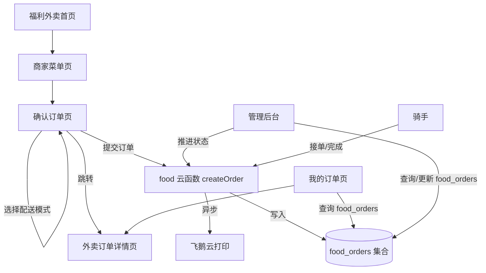
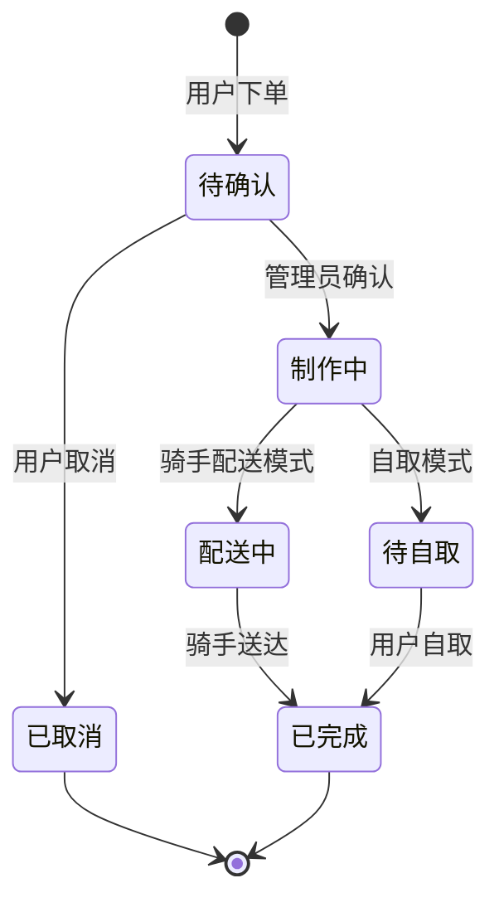

# Design Document: Food Order System

## Overview

将福利外卖订单从 `errand_tasks` 集合中独立出来，建立专属的 `food_orders` 集合。新系统支持骑手配送和到店自取两种模式，拥有独立的订单状态流、订单详情页和管理后台。

核心改动：
- 云函数 `food/index.js` 的 `createOrder` 改写入 `food_orders` 集合
- 新增外卖订单详情页 `src/pages/food/detail.vue`
- 确认订单页增加配送模式选择
- 订单列表页和管理后台改查 `food_orders`
- 小票打印从 `food_orders` 读取数据

## Architecture



### 状态流



状态码映射：
| status | 骑手配送 | 到店自取 | 颜色 |
|--------|---------|---------|------|
| 0 | 待确认 | 待确认 | #DD6B20 |
| 1 | 制作中 | 制作中 | #38A169 |
| 2 | 配送中 | 待自取 | #4299E1 |
| 3 | 已完成 | 已完成 | #A0AEC0 |
| 4 | 已取消 | 已取消 | #E53E3E |

## Components and Interfaces

### 前端页面改动

1. `src/pages/food/confirm.vue` — 增加配送模式选择器
   - 新增 `deliveryMode` ref，默认 `'delivery'`
   - 选择"到店自取"时隐藏地址输入、配送费归零
   - 提交时传递 `deliveryMode` 参数
   - 下单成功后跳转 `/pages/food/detail?id=xxx`（不再跳 errand/detail）

2. `src/pages/food/detail.vue` — 新建外卖订单详情页
   - 状态 Banner（根据 deliveryMode 显示不同文案）
   - 商品明细卡片
   - 配送信息卡片（自取时显示商家地址）
   - 骑手信息卡片（配送模式且已分配骑手时显示）
   - 操作按钮（取消订单、骑手接单、骑手完成）

3. `src/pages/food/orders.vue` — 改查 `food_orders`
   - `goDetail` 跳转改为 `/pages/food/detail?id=xxx`
   - 显示配送模式标签

4. `src/pages/admin/index.vue` — 外卖订单管理改查 `food_orders`
   - 管理员推进状态时根据 deliveryMode 显示不同文案

### 云函数改动

`cloudfunctions/food/index.js`:

- `createOrder`: 写入 `food_orders` 而非 `errand_tasks`，增加 `deliveryMode` 字段
- `myOrders`: 从 `food_orders` 查询
- `orderDetail`: 从 `food_orders` 查询
- `cancelOrder`: 从 `food_orders` 操作，限制 status <= 1
- `adminOrderList`: 从 `food_orders` 查询
- `updateOrderStatus`: 从 `food_orders` 操作，根据 deliveryMode 设置 statusText
- `reprintOrder`: 从 `food_orders` 读取
- 新增 `riderAccept`: 骑手接单，写入 riderId/riderName
- 新增 `riderComplete`: 骑手完成配送，更新状态为 3

### 路由配置

`src/pages.json` 的 food 子包新增：
```json
{ "path": "detail", "style": { "navigationBarTitleText": "订单详情", "navigationBarBackgroundColor": "#DD6B20", "navigationBarTextStyle": "white" } }
```

## Data Models

### food_orders 集合

```javascript
{
  _id: String,              // 自动生成
  openid: String,           // 下单用户 openid
  shopId: String,           // 商家 ID
  shopName: String,         // 商家名称
  items: [                  // 商品列表
    {
      itemId: String,
      name: String,
      price: Number,
      image: String,
      quantity: Number
    }
  ],
  itemsTotal: Number,       // 商品小计
  deliveryFee: Number,      // 配送费（自取为 0）
  totalPrice: Number,       // 总价
  deliveryMode: String,     // 'delivery' | 'self_pickup'
  address: String,          // 收货地址（自取时为空）
  phone: String,            // 联系电话
  userName: String,         // 收货人姓名
  remark: String,           // 备注
  status: Number,           // 0=待确认, 1=制作中, 2=配送中/待自取, 3=已完成, 4=已取消
  statusText: String,       // 状态文案
  riderId: String | null,   // 骑手 openid
  riderName: String | null, // 骑手名称
  riderPhone: String | null,// 骑手电话
  createTime: ServerDate    // 创建时间
}
```

### 状态转换函数（伪代码）

```javascript
function getStatusInfo(status, deliveryMode) {
  const map = {
    0: { text: '待确认', color: '#DD6B20' },
    1: { text: '制作中', color: '#38A169' },
    2: { 
      text: deliveryMode === 'self_pickup' ? '待自取' : '配送中', 
      color: '#4299E1' 
    },
    3: { text: '已完成', color: '#A0AEC0' },
    4: { text: '已取消', color: '#E53E3E' }
  }
  return map[status] || map[0]
}

function canCancel(status) {
  return status <= 1
}

function canRiderAccept(status, deliveryMode) {
  return status === 2 && deliveryMode === 'delivery'
}
```

## Correctness Properties

*A property is a characteristic or behavior that should hold true across all valid executions of a system — essentially, a formal statement about what the system should do. Properties serve as the bridge between human-readable specifications and machine-verifiable correctness guarantees.*

### Property 1: Order field completeness

*For any* food order created with valid input data, the resulting order document in `food_orders` SHALL contain all required fields: openid, shopId, shopName, items, itemsTotal, deliveryFee, totalPrice, deliveryMode, address, phone, userName, remark, status, riderId, createTime.

**Validates: Requirements 1.1, 1.2**

### Property 2: Delivery mode validation

*For any* food order, if deliveryMode is "self_pickup" then deliveryFee SHALL be 0; if deliveryMode is "delivery" then address SHALL be non-empty.

**Validates: Requirements 2.2, 2.3**

### Property 3: Initial status invariant

*For any* newly created food order, the status SHALL be 0 and statusText SHALL be "待确认".

**Validates: Requirements 3.1**

### Property 4: Valid status transitions

*For any* food order, the only valid status transitions are: 0→1 (confirm), 1→2 (ready), 2→3 (complete), and 0→4 or 1→4 (cancel). When transitioning to status 2, the statusText SHALL be "配送中" if deliveryMode is "delivery", or "待自取" if deliveryMode is "self_pickup".

**Validates: Requirements 3.2, 3.3, 3.4, 3.5, 3.6**

### Property 5: Invalid cancellation rejection

*For any* food order with status greater than 1, attempting to cancel SHALL be rejected and the order status SHALL remain unchanged.

**Validates: Requirements 3.7**

### Property 6: Rider acceptance stores rider info

*For any* food order with status 2 and deliveryMode "delivery", when a rider accepts the delivery, the order SHALL have riderId and riderName set to non-empty values.

**Validates: Requirements 5.1, 5.2**

## Error Handling

| 场景 | 处理方式 |
|------|---------|
| `food_orders` 集合不存在 | 云函数 catch 错误，返回 `{ code: -1, msg: '请先创建 food_orders 集合' }` |
| 下单时商品价格不一致 | 服务端重新计算价格，以服务端为准 |
| 骑手接单时订单已被接 | 检查 riderId 是否已存在，返回 `{ code: -1, msg: '该订单已被接单' }` |
| 取消已制作/配送中的订单 | 检查 status <= 1，否则返回 `{ code: -1, msg: '当前状态不可取消' }` |
| 非本人操作订单 | 校验 openid 一致性，返回 `{ code: -1, msg: '无权操作' }` |
| 打印机未配置 | 打印失败不阻塞下单，仅记录日志 |

## Testing Strategy

### 单元测试

使用 Vitest 进行单元测试，重点覆盖：
- 状态转换函数 `getStatusInfo` 的各种输入组合
- `canCancel` 和 `canRiderAccept` 的边界条件
- 订单价格计算逻辑（商品小计 + 配送费）
- 自取模式下配送费归零逻辑

### 属性测试

使用 fast-check 进行属性测试，每个属性至少运行 100 次迭代。

每个属性测试需标注对应的设计属性：
- **Feature: food-order-system, Property 1: Order field completeness**
- **Feature: food-order-system, Property 2: Delivery mode validation**
- **Feature: food-order-system, Property 3: Initial status invariant**
- **Feature: food-order-system, Property 4: Valid status transitions**
- **Feature: food-order-system, Property 5: Invalid cancellation rejection**
- **Feature: food-order-system, Property 6: Rider acceptance stores rider info**

测试文件位置：`tests/food-order-system/`

### 测试重点

- 核心逻辑（状态转换、价格计算、配送模式验证）通过属性测试覆盖
- 边界情况（空购物车、缺少必填字段）通过单元测试覆盖
- 云函数的集成行为通过手动测试在微信开发者工具中验证
